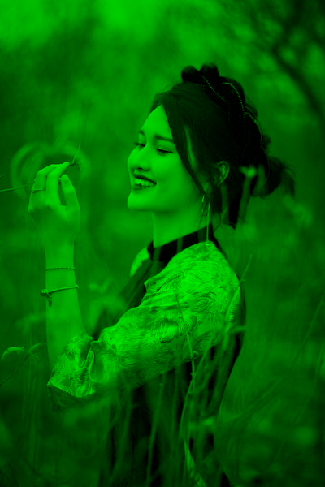
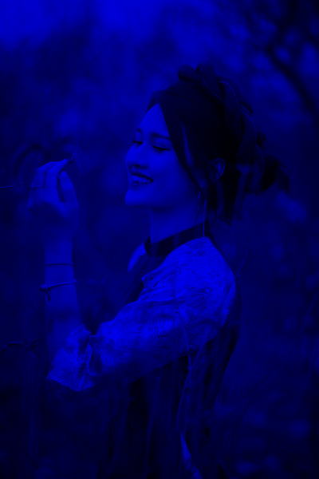
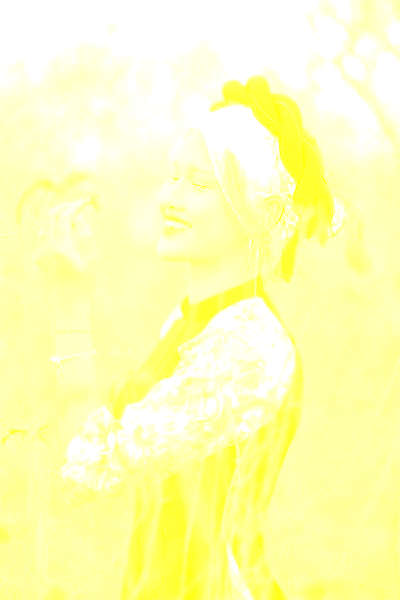

# Color Separator

This project is a Java Swing application built with NetBeans IDE that separates an input image into its individual color channels (RGBA or CMYK), with options for contrast adjustment, color inversion, and colored/grayscale outputs.

  
  
  

  
  
  

## Features

- **RGBA & CMYK Separation**  
  - Extract Red, Green, Blue, and Alpha channels  
  - Extract Cyan, Magenta, Yellow, and Black channels  
- **Contrast Adjustment**  
  - Interactive slider from –255 to +255 for fine-tuning  
- **Invert Toggle**  
  - Invert channel values  
- **Colored vs Grayscale Output**  
  - Display each channel in its native color or as monochrome  
- **Drag & Drop UI**  
  - Process multiple PNG/JPG/JPEG files at once by dragging onto the window  
- **Automatic Naming**  
  - Outputs prefixed with `RGBA[invert,colored]_color_channel` or `CMYK[invert,colored]_color_channel` plus channel name  

## How to Use

1. **Run** the provided executable `ColorSeparator.jar`
2. Adjust the **Contrast** slider and toggle **Invert** / **Colored** as desired.  
5. Select **RGBA** or **CMYK** channels using the side buttons.  
6. Drag and drop one or more PNG/JPG/JPEG files onto the main window.  
7. Wait for processing; the UI will briefly display “Images Generated” before resetting.  
8. Find the separated channel images saved next to the originals.
